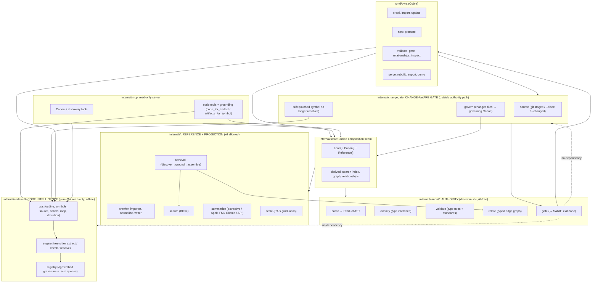
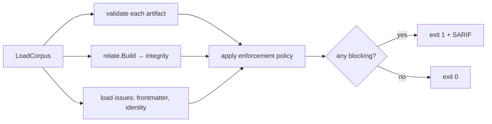
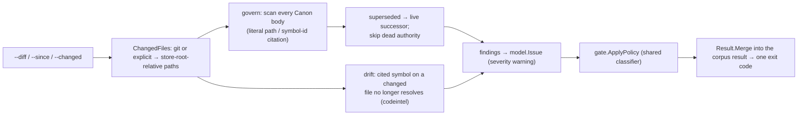
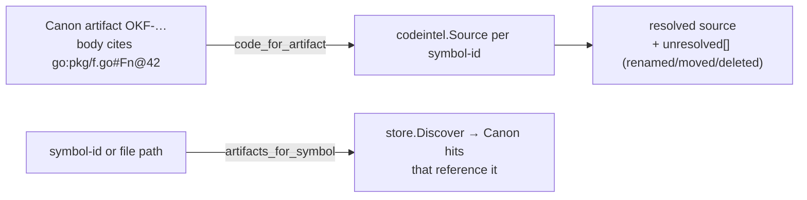

# Architecture

Pyra is a **single Go binary** that gives AI coding agents an enforceable authority
layer over one substrate: plain Markdown plus YAML frontmatter, versioned in Git. It is
built for spec-driven development, where the specs a workflow already produces become
typed, gated **Canon** that agents are held to automatically.

Pyra holds two kinds of memory:

- **Canon**, the *authority* tier. Typed, validated, enforced normative artifacts
  (requirements, decisions, designs, roadmaps, prompts). This is the durable system of
  record: *what is true.* The authority engine is a faithful Go port of **rac-core**
  ("Requirements as Code").
- **Reference**, the *discoverability* tier. Optional ingested documentation (crawled
  sites, imported Markdown) rendered as a navigable Open Knowledge Format (OKF) bundle of
  abundant, summarized, fast-changing supporting material.

Alongside these two memory tiers, Pyra exposes a third, non-memory capability:

- **Code intelligence**, a *live view of source*. Not stored memory — a read-only,
  structural read of the repository's code via a pure-Go tree-sitter runtime
  (`internal/codeintel`). It answers "what does the code actually do?" (outline, symbols,
  source, callers, map, definition, check) with byte-precise, token-cheap results behind
  stable **symbol-ids**, and **grounds Canon in code**: it resolves an authoritative
  artifact to the real symbols it governs, and a symbol back to the artifacts that
  reference it. This centralizes authoritative decisions and real code search into one
  binary and one MCP server.

The guiding model:

> **Memory is Canon. Context is the budgeted projection of Canon plus Reference.
> AI lives only in the projection. The substrate is Git. Indexes are derived.**

The tool is **authority-first**: Canon leads and is enforced, and Reference supports it.
The agent-facing loop is **discover (fuzzy) → ground (in Canon, with a citation) →
assemble (under a token budget)**.

---

## Design principles

1. **The authority path is deterministic and AI-free.** No package under
   `internal/canon/...` may import the summarizer, an HTTP client, or an on-device LLM
   bridge, a constraint enforced by a build-failing architecture test
   (`internal/canon/archcheck_test.go`). Classification, validation, relationship
   integrity, and the gate are pure functions of repository state.
2. **Authority and discoverability are orthogonal.** Relevance (search) is upstream of
   truth (grounding). The agent always lands on an authoritative, status-checked artifact,
   not a similar-looking chunk.
3. **Indexes are derived, rebuildable projections.** Full-text search, the relationship
   graph, and summaries can be deleted and regenerated from the Markdown; truth is never
   coupled to plumbing.
4. **Type-conditional strictness.** Canon *blocks* (the gate); Reference *warns* (filing-
   cabinet health). One store holds both honestly.
5. **Additive and backward compatible.** A store with no Canon behaves exactly like the
   original Pyra; no gate is imposed on a pure-Reference store.
6. **Writes happen outside the serve path.** All mutation is via CLI / Git PR review; the
   MCP server is read-only.
7. **Code intelligence is read-only, pure-Go, and outside the authority path.**
   `internal/codeintel` only reads source (never mutates), honors `.gitignore`, and
   confines traversal to the working root. It uses a **pure-Go, cgo-free** tree-sitter
   runtime with embedded grammars, so it adds no native toolchain and the binary still
   cross-compiles with plain `go build`. It lives outside `internal/canon/...` and a
   dedicated boundary test proves the authority path never depends on it, so the gate stays
   deterministic and offline.
8. **The gate evaluates change, not just Canon.** By default `pyra gate` checks that
   *Canon* is well-formed; in change-aware mode (`--diff` / `--since` / `--changed`) it
   also reports which Accepted Canon governs each changed file and flags drift on touched
   code. This mapping needs `store` + `codeintel`, so it lives in `internal/changegate`,
   **outside** `internal/canon/...` — the same quarantine as code intelligence, enforced by
   the same boundary test. It stays a pure structural function of repository state (no LLM,
   no network): it surfaces and cites governed change, it never renders a semantic verdict.

---

## High-level structure



The dashed edges are load-bearing: `internal/codeintel` and `internal/changegate` both sit
outside `internal/canon/...`, so the gate's dependency graph — and therefore its
deterministic, offline behavior — is unaffected by either. The change-aware gate *consumes*
the corpus gate's classifier (`gate.ApplyPolicy`) and merges its findings; the corpus gate
never depends on it.

---

## Package map

### Authority engine: `internal/canon/...` (ported from rac-core)

| Package | Responsibility | rac-core origin |
|---|---|---|
| `canon` | Corpus loader: walk Canon roots, parse, harden frontmatter, classify, resolve identity → `Artifact` | `core/corpus.py` |
| `canon/model` | The "Product AST": `Product`, `Requirement`, `MalformedRequirement`, `Issue`, `Frontmatter` | `core/models.py` |
| `canon/parse` | Markdown → `Product` via **goldmark** (fence-aware section + requirement extraction) | `core/markdown.py` |
| `canon/artifacts` | The five typed `ArtifactSpec`s: required/recommended/optional sections, synonyms, metadata enums, retired-status | `core/artifacts.py` |
| `canon/classify` | Type inference by section scoring (`required + 0.5·recommended` over a ceiling; unknown below 0.5 / no required match) | `core/classification.py` |
| `canon/frontmatter` | Strict YAML envelope: unknown/duplicate-key rejection, alias/depth/size bomb guards, schema-version migration | `core/frontmatter.py` |
| `canon/identity` | Mint opaque IDs (`<repo-key>-<12-char Crockford base32>`); resolve canonical ID + legacy aliases | `core/identity.py` |
| `canon/validate` | Type-conditional validation + requirement-quality standards (BCP-14/RFC 8174, ISO/IEC/IEEE 29148, EARS), metadata enums, ticket format-lint | `core/validation.py` |
| `canon/relate` | Typed relationship graph + integrity (referential, range, edge-legality, status-consistency, acyclicity) and the display/traversal/portfolio views | `core/relationship_types.py`, `services/relationships.py` |
| `canon/recency` | Git-derived modification times (mtime fallback) | `services/recency.py` |
| `canon/gate` | Orchestrate validate + relate + load issues; apply enforcement policy; aggregate result | `services/gate.py` |

### Composition, retrieval, output, and serving

| Package | Responsibility |
|---|---|
| `internal/config` | `.okf/config.yaml`: `repository_key`, `canon_roots`, `spec_roots`, `code_roots`, `ticketing.provider`, `enforcement` policy |
| `internal/store` | The seam: load both tiers into one `Item`, build the unified search index, relationship graph, and resolved relationships; `Rebuild()` regenerates all derived state |
| `internal/retrieval` | The agent loop: `Assemble` = discover (both tiers) → ground (Canon: status, edges, citation; resolve superseded → successor) → pack under a token budget (Canon-first; `[REQ-NNN]` text kept verbatim; overflow → follow-up) |
| `internal/sarif` | SARIF 2.1.0 emitter for CI |
| `internal/changegate` | The **change-aware gate** (outside `internal/canon/...`): given a changed-file set (git staged / `--since` / explicit), resolve which Accepted Canon artifacts govern each file (literal path or symbol-id citation, deterministic full-corpus scan) and report drift on touched code. Emits ordinary `model.Issue`s classified by the shared `gate.ApplyPolicy` and merged into the corpus result. Depends on `store` + `codeintel`, so it is quarantined here and a boundary test forbids `internal/canon/...` from importing it. |
| `internal/changerisk` | **Change-risk** (outside `internal/canon/...`): score a change (staged / commit / range) for defect risk from Kamei JIT diff metrics, lead with a repo-relative ranking, and emit PR directives (`risk-missing-tests`, `risk-missing-cochanges`, `risk-will-break`, `risk-governance` — the last reusing `changegate`). The scoring model + learned constants are confined to `model_constants.go` (swappable) and pinned by a parity test. Emits `model.Issue`s merged via `gate.ApplyPolicy`. Depends on `gitint` + `codeintel` + `store`. |
| `internal/deadcode` | **Dead-code detection** (outside `internal/canon/...`): a thin consumer of `codegraph.Reachability` — it takes the `Unreachable` set, tiers each symbol by confidence (high = no references · medium = has textual/dynamic references · low = test helper) via one whole-source scan, estimates cleanup impact (line count via `codeintel.Source`), and flags governed dead code (an unreachable symbol still cited by Canon, literal symbol-id match). Excludes `Test*`/`main`. Surfaced via `pyra dead-code` and `get_dead_code`. Depends on `codegraph` + `codeintel` + `store`. |
| `internal/codehealth` | The **code-health layer** (outside `internal/canon/...`): scores every file across three independently-capped signals (defect / maintainability / performance) from a ~28-marker deterministic biomarker roster over `codeintel` (a new AST-**metrics** pass: cyclomatic complexity, nesting, LCOM4 field access, error patterns), `gitint`, `codegraph`, and Canon governance, plus LCOV/Cobertura coverage ingestion and a Rabin–Karp clone detector. The scoring **kernel + calibrated constants** are confined to `kernel_constants.go` and pinned by a parity test. Surfaced via `pyra health` and `get_health`. Governance markers (`ungoverned_hotspot`/`stale_governance`/`contradictory_decision`) are the authority tie-in. The performance dimension is wired but present-but-empty (detectors deferred). Depends on `codeintel` + `gitint` + `codegraph` + `store` + `changegate`. |
| `internal/codegraph` | The **code dependency graph** (outside `internal/canon/...`): from one `codeintel.Map` walk of the code roots it builds two-tier file+symbol nodes with containment, reference (name-resolved, edge-to-all-matches), and derived file→file edges, then runs standard self-contained analyses — PageRank centrality, deterministic label-propagation communities, Tarjan SCC cycles, and entry-point reachability (whose unreachable set feeds dead-code, #5). Surfaced via `pyra graph` and the `get_graph_centrality`/`get_communities`/`get_cycles` MCP tools (lazily built + cached on the server). No external graph library, no learned constants; betweenness + Leiden deferred. Depends on `codeintel` + `config`. |
| `internal/gitint` | The **git-intelligence layer** (outside `internal/canon/...`): from one bounded `git log --numstat` walk it derives per-file metrics (commit windows, churn, age, temporal hotspot score, ownership %, recent owner, contributor count, bus factor, co-change), a repo-relative hotspot ranking (top-quartile churn + activity floors), and top-level-module rollups — all anchored to HEAD's commit time for byte-identical reruns. Pure git (no `codeintel` import; the "co-change minus import edges" join lives in `changerisk`). Surfaced via `pyra hotspots` / `pyra ownership` and the `get_hotspots` / `get_ownership` MCP tools; the `Churn`/`CoChangePartners`/`AuthorCommits` API is preserved for `changerisk`. |
| `internal/mcp` | Read-only MCP server exposing Canon + discovery tools, the code-intelligence tools, and the two Canon↔code grounding tools |

### Code intelligence: `internal/codeintel` (pure-Go, read-only, offline)

A native Go re-implementation of structural code search/navigation over a **pure-Go,
cgo-free** tree-sitter runtime (`github.com/odvcencio/gotreesitter`). The `symbol-id`
scheme, output shapes, and extraction semantics mirror grove for parity.

| File | Responsibility |
|---|---|
| `codeintel.go` | Package doc + the output types (`Symbol`, `Defect`, `SourceResult`, `CallSite`, `FileMap`/`MapEntry`, `DefinitionResult`). |
| `symbolid.go` | The `symbol-id` scheme `<lang>:<relpath>#<name>@<line>` (1-based): `FormatID`, and the two distinct parsers `ParseID` and `ParsePos`. |
| `registry.go` + `registry/<lang>/` | `//go:embed`-ed per-language `tags.scm`/`locals.scm`/`imports.scm` + `profile.json`; resolves a file to its grammar (via gotreesitter) and query set. Supported: Go, Python, JavaScript, TypeScript, TSX, Java, Rust. |
| `engine.go`, `resolve.go` | Parse-on-demand extraction (tags query → `Symbol`s, parent via `containers`, overlap dedup), `Check` (ERROR/MISSING), and scope-aware `definition --at` resolution. |
| `ops.go`, `opshelpers.go`, `imports.go`, `ignore.go` | The seven operations, `.gitignore`-aware/root-confined directory walks, and import-edge resolution (`dotted_package` / `relative_path`). |

Grammars are embedded at build time via gotreesitter's `grammar_subset` build tags (set in
the Makefile), so no operation performs any network access and the release binary stays
lean. Both faces — CLI subcommands (`internal/cli/codeintel.go`) and MCP tools
(`internal/mcp/codeintel.go`) — call the same `Ops`, so their results are equivalent.

### Reference engine: existing Pyra packages (unchanged half)

`crawler`, `importer`, `reader`, `normalize`, `writer` (ingestion → OKF bundle);
`graph` (untyped backlinks); `search` (in-memory Bleve over both tiers); `context`
(legacy Reference-only assembly); `compress`, `tokens` (budgeting); `scale` (ceiling
detection + RAG guidance); `summarize` (+ `summarize/llm`: extractive `sumer`, Apple
Foundation Models, Ollama, OpenAI-compatible); `changelog`, `differ`, `updater` (live
update); `embed` (demo bundle); `util`, `types`.

---

## Data flow

### Ingestion (Reference)

```
crawl/import → RawDocument → normalize → NormalizedDocument
  → writer: assign paths, rewrite links, compute backlinks, generate summary
            (extractive or LLM), inject "> [!summary]" callout, write frontmatter
  → bundle on disk (concepts + index.md + changelog.txt)
```

### Authoring (Canon)

```
pyra new <type> <path>      → scaffold typed artifact, mint ID  (CLI only)
pyra promote <concept>      → seed a Canon draft from a Reference concept
human edits + Git PR review     → the trust boundary
pyra gate                   → CI check; blocks bad Canon (exit 1 + SARIF)
```

### The gate pipeline (`canon/gate`)



`Policy` (from `.okf/config.yaml` `enforcement`) classifies each finding code as
blocking / advisory / disabled; otherwise the finding's intrinsic severity decides
(error → blocking).

### The change-aware gate (`internal/changegate`)



The change set is resolved from the git staged index (default), a `--since <ref>` range,
or an explicit `--changed` list (which bypasses git and works in a non-git tree). Paths are
normalized to store-root-relative slash form; anything outside the store root is dropped.
Governance is matched at **file granularity** by iterating the full Canon corpus in load
order (never the fuzzy search index) so results are complete and deterministic, and only
from **literal** references — a file path or a symbol-id whose path is that file — never
fuzzy matching. Two stable finding codes are emitted, both advisory by default and
escalatable via `enforcement`:

| Code | Meaning |
|---|---|
| `canon-governed-change` | a changed file is governed by an Accepted artifact (path or symbol-id citation) |
| `governed-symbol-unresolved` | a governing artifact cites a symbol on a changed file that no longer resolves (renamed / moved / deleted) |

Because the findings are ordinary `model.Issue`s classified by the same `gate.ApplyPolicy`
and merged with `Result.Merge`, every existing renderer (text / JSON / SARIF) and the single
exit code cover them with no new plumbing. With no change flag, the gate is byte-identical to
before.

### Retrieval (`internal/retrieval`)

```mermaid
sequenceDiagram
    participant Agent
    participant MCP
    participant Store
    Agent->>MCP: get_context(query, token_budget)
    MCP->>Store: Discover(query)  (Bleve over both tiers)
    Store-->>MCP: candidates (tier, score)
    MCP->>Store: ground Canon hits (status, edges, citation)
    Note over MCP: superseded → resolve to successor
    MCP->>MCP: assemble: Canon first; compress Reference;<br/>preserve [REQ-NNN] verbatim; overflow → follow-up
    MCP-->>Agent: budgeted context + citations
```

### Code intelligence (parse on demand)

```
outline/symbols/source/callers/map/definition/check
  → registry.ForFile: detect language, load embedded grammar + tags/locals/imports queries
  → engine.Extract: parse once (tree-sitter), run tags query → []Symbol (each with a symbol-id)
  → op-specific shaping (detail tiers, structural+textual callers, innermost-enclosing refs, …)
  → JSON (CLI --json / MCP), symbol-ids stable across calls
```

No index and no cache beyond compiled queries: every call parses the file(s) it needs, so
identical repository state yields identical results.

### Grounding: how Canon maps to code

The bridge is the **symbol-id**. A Canon artifact names the code it governs by mentioning a
symbol-id in its prose — the same literal-reference model used for `OKF-…` relationships
between artifacts (no fuzzy matching). The `internal/mcp` grounding tools (and
`pyra ground`) traverse it both ways, bridging `store.Store` and `codeintel.Ops`:



Both tools are **read-only** and never write Canon. An unresolvable reference is reported as
unresolved rather than matched to the wrong symbol, so the authority↔implementation link is
honest: a reviewer can see when an artifact's cited code has drifted out from under it.

---

## The Canon model in detail

- **Artifact types** (inferred from `##` sections, never declared in the body):
  Requirement, Decision, Design, Roadmap, Prompt. Each `ArtifactSpec` declares required,
  recommended, and optional sections, section synonyms, constrained metadata enums
  (e.g. a Decision's `status` *and* `category`), and the lifecycle states that mark an
  artifact retired.
- **Identity**: an opaque `<repo-key>-<12 Crockford base32>` ID, minted once at creation
  and never re-derived on read. References resolve against an alias index (canonical ID
  plus legacy aliases such as `## ID`, a filename prefix like `adr-002`, or the filename stem), so
  human-readable cross-references keep resolving.
- **Validation** (type-conditional): exactly one `# ` title; required sections present;
  well-formed `[REQ-NNN]` IDs (missing / malformed / empty / duplicate); constrained
  metadata enums; and requirement-quality standards: **BCP-14/RFC 8174** keyword casing
  (error), **ISO/IEC/IEEE 29148** singular-requirement (warning), **EARS** conformance
  and `If`/`then` clause (warning), ambiguous verbs (warning). Roadmaps add horizon and
  advancement-link checks. External `## Related Tickets` entries are format-linted against
  the configured provider, never network-resolved.
- **Relationships**: typed edges declared as `## Related <Type>` / `## Supersedes`.
  Integrity checks (stable codes, rac-core parity):
  `relationship-target-not-found`, `relationship-target-ambiguous`,
  `relationship-self-reference`, `relationship-edge-unsupported`,
  `relationship-target-type-mismatch`, `relationship-target-superseded`,
  `relationship-cycle`, `duplicate-artifact-identifier`. Plus display/traversal/portfolio
  views: outgoing/incoming references, a bounded multi-hop `Neighborhood`, and a coverage
  / orphan / broken `Summarize`.
- **Recency** is derived from Git history, never stored in frontmatter; a missing repo
  degrades to filesystem mtime with a single advisory.

---

## Conformance to rac-core

Semantic drift between the Go port and rac-core's Python is the primary risk, so the
behavior is pinned against rac-core's **real, dogfooded corpus**:

- `internal/canon/testdata/conformance/` holds verbatim rac-core artifacts; tests assert
  the engine's type inference, structural validity, and opaque-ID acceptance match.
- The issue codes and severities (validation + relationships) are ported verbatim, so the
  SARIF rule IDs line up with rac-core's.

When interoperating, the two tools meet at the Open Knowledge Format: rac-core can
`export --okf`, and Pyra speaks OKF natively.

---

## Testing strategy

- **Unit tests** per Canon package (classification boundaries, identity format, frontmatter
  bomb guards, each validation rule on/off, every relationship integrity rule, the
  traversal/summary views).
- **Architecture test**: fails the build if `internal/canon/...` ever imports the
  summarizer, `net/http`, or the Foundation Models bridge (Requirement: AI-free authority).
- **Conformance tests** against real rac-core fixtures (anti-drift).
- **Determinism test**: the gate produces byte-identical output across runs on identical
  repo state (no time/RNG dependence).
- **Backward-compatibility**: pure-Reference stores impose no gate and behave as legacy.
- **Retrieval tests**: authority-first ranking, verbatim `[REQ-NNN]` fidelity under
  compression, superseded→successor resolution, overflow → follow-up.
- **Code-intelligence tests**: per-language extraction/parity for every supported grammar,
  symbol-id round-trip and the two-parser edge cases, the seven operations, `.gitignore`
  (root + nested) and root-confinement, and grounding in both directions (including the
  `unresolved` path). Run under `-race`.
- **Code-intelligence boundary test**: fails the build if `internal/canon/...` ever depends
  on `internal/codeintel`, `internal/changegate`, `internal/changerisk`, `internal/gitint`,
  `internal/codegraph`, `internal/codehealth`, `internal/deadcode`, or the tree-sitter runtime, keeping the gate
  untouched by any of these features. The Makefile's `build-all` (with `CGO_ENABLED=0`) is the executable proof
  that the binary stays cgo-free and cross-compilable.
- **Code-graph tests**: build (node/containment/reference edges incl. name-collision
  edge-to-all, file-edge aggregation, unresolved→no-edge, node-cap truncation, per-language
  exported detection); PageRank (hub outranks leaf, dangling handling, determinism);
  label-propagation communities (two clusters split, reproducible); Tarjan cycles (mutual +
  self-loop reported, acyclic ignored); reachability (exported/main roots, no-entry-points →
  all unreachable); a build-and-analyze-twice + root-order-independence determinism test; and
  CLI/MCP equivalence.
- **Change-risk tests**: model parity (golden table, ±0.05) and determinism; feature extraction 
- (numstat, entropy edge cases, author experience);
  repo-relative ranking (mid-rank percentile with ties, tercile boundaries, unavailable under
  the minimum baseline); the `gitint` substrate (churn, co-change, author counts, non-git
  degrade); the four directives (convention-map missing-tests incl. Rust in-file, co-change
  minus import edges, dependents, governance reuse); and the merged gate result / exit code /
  JSON / SARIF with policy escalation.
- **Change-aware gate tests**: change sourcing (staged / `--since` / explicit / non-git →
  clear error / nested-store path normalization); governance matching (cite-by-path,
  cite-by-symbol-id, path-boundary non-matches, superseded→successor, dead-authority skip);
  drift (unresolved cited symbol reported, never mis-matched; nil-ops and deleted-file
  paths); policy classification and single merged exit code (advisory default, blocking via
  enforcement, corpus-blocking + change-advisory); JSON/SARIF field and location stability;
  determinism across runs; and a backward-compat golden proving the no-flags gate equals the
  corpus gate byte-for-byte.

---

## Spec

The full requirements, design, and task breakdown live under the spec directories.
