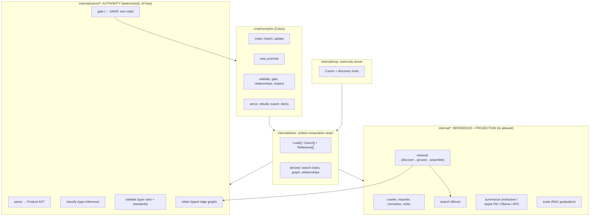
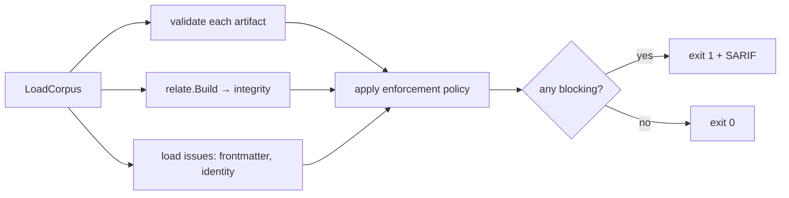

# Architecture

Memphis is a **single Go binary** that gives AI coding agents an enforceable authority
layer over one substrate: plain Markdown plus YAML frontmatter, versioned in Git. It is
built for spec-driven development, where the specs a workflow already produces become
typed, gated **Canon** that agents are held to automatically.

Memphis holds two kinds of memory:

- **Canon**, the *authority* tier. Typed, validated, enforced normative artifacts
  (requirements, decisions, designs, roadmaps, prompts). This is the durable system of
  record: *what is true.* The authority engine is a faithful Go port of **rac-core**
  ("Requirements as Code").
- **Reference**, the *discoverability* tier. Optional ingested documentation (crawled
  sites, imported Markdown) rendered as a navigable Open Knowledge Format (OKF) bundle of
  abundant, summarized, fast-changing supporting material.

The guiding model:

> **Memory is Canon. Context is the budgeted projection of Canon plus Reference.
> AI lives only in the projection. The substrate is Git. Indexes are derived.**

The tool is **authority-first**: Canon leads and is enforced, and Reference supports it.
The agent-facing loop is **discover (fuzzy) → ground (in Canon, with a citation) →
assemble (under a token budget)**.

---

## Design principles

1. **The authority path is deterministic and AI-free.** No package under
   `internal/canon/...` may import the summarizer, an HTTP client, or an on-device LLM
   bridge, a constraint enforced by a build-failing architecture test
   (`internal/canon/archcheck_test.go`). Classification, validation, relationship
   integrity, and the gate are pure functions of repository state.
2. **Authority and discoverability are orthogonal.** Relevance (search) is upstream of
   truth (grounding). The agent always lands on an authoritative, status-checked artifact,
   not a similar-looking chunk.
3. **Indexes are derived, rebuildable projections.** Full-text search, the relationship
   graph, and summaries can be deleted and regenerated from the Markdown; truth is never
   coupled to plumbing.
4. **Type-conditional strictness.** Canon *blocks* (the gate); Reference *warns* (filing-
   cabinet health). One store holds both honestly.
5. **Additive and backward compatible.** A store with no Canon behaves exactly like the
   original Memphis; no gate is imposed on a pure-Reference store.
6. **Writes happen outside the serve path.** All mutation is via CLI / Git PR review; the
   MCP server is read-only.

---

## High-level structure



---

## Package map

### Authority engine: `internal/canon/...` (ported from rac-core)

| Package | Responsibility | rac-core origin |
|---|---|---|
| `canon` | Corpus loader: walk Canon roots, parse, harden frontmatter, classify, resolve identity → `Artifact` | `core/corpus.py` |
| `canon/model` | The "Product AST": `Product`, `Requirement`, `MalformedRequirement`, `Issue`, `Frontmatter` | `core/models.py` |
| `canon/parse` | Markdown → `Product` via **goldmark** (fence-aware section + requirement extraction) | `core/markdown.py` |
| `canon/artifacts` | The five typed `ArtifactSpec`s: required/recommended/optional sections, synonyms, metadata enums, retired-status | `core/artifacts.py` |
| `canon/classify` | Type inference by section scoring (`required + 0.5·recommended` over a ceiling; unknown below 0.5 / no required match) | `core/classification.py` |
| `canon/frontmatter` | Strict YAML envelope: unknown/duplicate-key rejection, alias/depth/size bomb guards, schema-version migration | `core/frontmatter.py` |
| `canon/identity` | Mint opaque IDs (`<repo-key>-<12-char Crockford base32>`); resolve canonical ID + legacy aliases | `core/identity.py` |
| `canon/validate` | Type-conditional validation + requirement-quality standards (BCP-14/RFC 8174, ISO/IEC/IEEE 29148, EARS), metadata enums, ticket format-lint | `core/validation.py` |
| `canon/relate` | Typed relationship graph + integrity (referential, range, edge-legality, status-consistency, acyclicity) and the display/traversal/portfolio views | `core/relationship_types.py`, `services/relationships.py` |
| `canon/recency` | Git-derived modification times (mtime fallback) | `services/recency.py` |
| `canon/gate` | Orchestrate validate + relate + load issues; apply enforcement policy; aggregate result | `services/gate.py` |

### Composition, retrieval, output, and serving

| Package | Responsibility |
|---|---|
| `internal/config` | `.okf/config.yaml`: `repository_key`, `canon_roots`, `ticketing.provider`, `enforcement` policy |
| `internal/store` | The seam: load both tiers into one `Item`, build the unified search index, relationship graph, and resolved relationships; `Rebuild()` regenerates all derived state |
| `internal/retrieval` | The agent loop: `Assemble` = discover (both tiers) → ground (Canon: status, edges, citation; resolve superseded → successor) → pack under a token budget (Canon-first; `[REQ-NNN]` text kept verbatim; overflow → follow-up) |
| `internal/sarif` | SARIF 2.1.0 emitter for CI |
| `internal/mcp` | Read-only MCP server exposing Canon + discovery tools |

### Reference engine: existing Memphis packages (unchanged half)

`crawler`, `importer`, `reader`, `normalize`, `writer` (ingestion → OKF bundle);
`graph` (untyped backlinks); `search` (in-memory Bleve over both tiers); `context`
(legacy Reference-only assembly); `compress`, `tokens` (budgeting); `scale` (ceiling
detection + RAG guidance); `summarize` (+ `summarize/llm`: extractive `sumer`, Apple
Foundation Models, Ollama, OpenAI-compatible); `changelog`, `differ`, `updater` (live
update); `embed` (demo bundle); `util`, `types`.

---

## Data flow

### Ingestion (Reference)

```
crawl/import → RawDocument → normalize → NormalizedDocument
  → writer: assign paths, rewrite links, compute backlinks, generate summary
            (extractive or LLM), inject "> [!summary]" callout, write frontmatter
  → bundle on disk (concepts + index.md + changelog.txt)
```

### Authoring (Canon)

```
memphis new <type> <path>      → scaffold typed artifact, mint ID  (CLI only)
memphis promote <concept>      → seed a Canon draft from a Reference concept
human edits + Git PR review     → the trust boundary
memphis gate                   → CI check; blocks bad Canon (exit 1 + SARIF)
```

### The gate pipeline (`canon/gate`)



`Policy` (from `.okf/config.yaml` `enforcement`) classifies each finding code as
blocking / advisory / disabled; otherwise the finding's intrinsic severity decides
(error → blocking).

### Retrieval (`internal/retrieval`)

```mermaid
sequenceDiagram
    participant Agent
    participant MCP
    participant Store
    Agent->>MCP: get_context(query, token_budget)
    MCP->>Store: Discover(query)  (Bleve over both tiers)
    Store-->>MCP: candidates (tier, score)
    MCP->>Store: ground Canon hits (status, edges, citation)
    Note over MCP: superseded → resolve to successor
    MCP->>MCP: assemble: Canon first; compress Reference;<br/>preserve [REQ-NNN] verbatim; overflow → follow-up
    MCP-->>Agent: budgeted context + citations
```

---

## The Canon model in detail

- **Artifact types** (inferred from `##` sections, never declared in the body):
  Requirement, Decision, Design, Roadmap, Prompt. Each `ArtifactSpec` declares required,
  recommended, and optional sections, section synonyms, constrained metadata enums
  (e.g. a Decision's `status` *and* `category`), and the lifecycle states that mark an
  artifact retired.
- **Identity**: an opaque `<repo-key>-<12 Crockford base32>` ID, minted once at creation
  and never re-derived on read. References resolve against an alias index (canonical ID
  plus legacy aliases such as `## ID`, a filename prefix like `adr-002`, or the filename stem), so
  human-readable cross-references keep resolving.
- **Validation** (type-conditional): exactly one `# ` title; required sections present;
  well-formed `[REQ-NNN]` IDs (missing / malformed / empty / duplicate); constrained
  metadata enums; and requirement-quality standards: **BCP-14/RFC 8174** keyword casing
  (error), **ISO/IEC/IEEE 29148** singular-requirement (warning), **EARS** conformance
  and `If`/`then` clause (warning), ambiguous verbs (warning). Roadmaps add horizon and
  advancement-link checks. External `## Related Tickets` entries are format-linted against
  the configured provider, never network-resolved.
- **Relationships**: typed edges declared as `## Related <Type>` / `## Supersedes`.
  Integrity checks (stable codes, rac-core parity):
  `relationship-target-not-found`, `relationship-target-ambiguous`,
  `relationship-self-reference`, `relationship-edge-unsupported`,
  `relationship-target-type-mismatch`, `relationship-target-superseded`,
  `relationship-cycle`, `duplicate-artifact-identifier`. Plus display/traversal/portfolio
  views: outgoing/incoming references, a bounded multi-hop `Neighborhood`, and a coverage
  / orphan / broken `Summarize`.
- **Recency** is derived from Git history, never stored in frontmatter; a missing repo
  degrades to filesystem mtime with a single advisory.

---

## Conformance to rac-core

Semantic drift between the Go port and rac-core's Python is the primary risk, so the
behavior is pinned against rac-core's **real, dogfooded corpus**:

- `internal/canon/testdata/conformance/` holds verbatim rac-core artifacts; tests assert
  the engine's type inference, structural validity, and opaque-ID acceptance match.
- The issue codes and severities (validation + relationships) are ported verbatim, so the
  SARIF rule IDs line up with rac-core's.

When interoperating, the two tools meet at the Open Knowledge Format: rac-core can
`export --okf`, and Memphis speaks OKF natively.

---

## Testing strategy

- **Unit tests** per Canon package (classification boundaries, identity format, frontmatter
  bomb guards, each validation rule on/off, every relationship integrity rule, the
  traversal/summary views).
- **Architecture test**: fails the build if `internal/canon/...` ever imports the
  summarizer, `net/http`, or the Foundation Models bridge (Requirement: AI-free authority).
- **Conformance tests** against real rac-core fixtures (anti-drift).
- **Determinism test**: the gate produces byte-identical output across runs on identical
  repo state (no time/RNG dependence).
- **Backward-compatibility**: pure-Reference stores impose no gate and behave as legacy.
- **Retrieval tests**: authority-first ranking, verbatim `[REQ-NNN]` fidelity under
  compression, superseded→successor resolution, overflow → follow-up.

---

## Spec

The full requirements, design, and task breakdown for this implementation live under
[`specs/unified-agent-memory/`](./specs/unified-agent-memory/).
