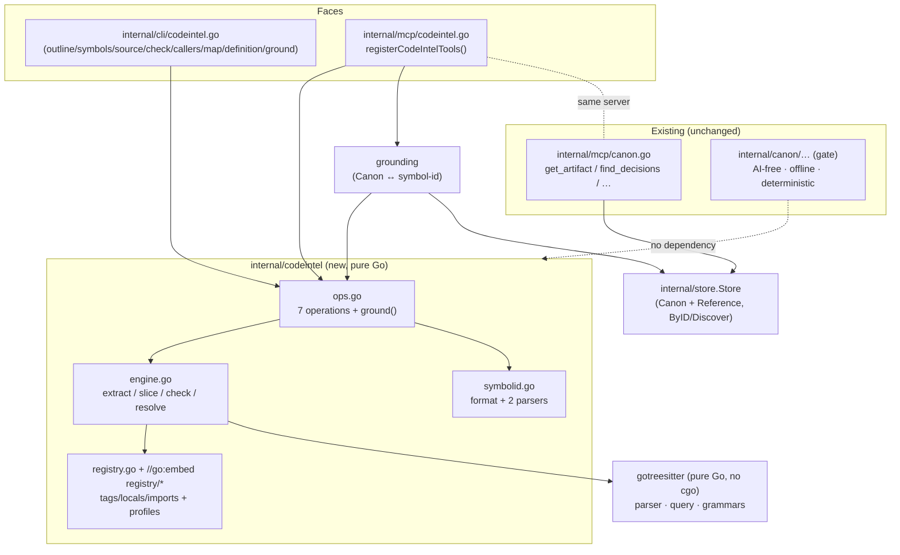
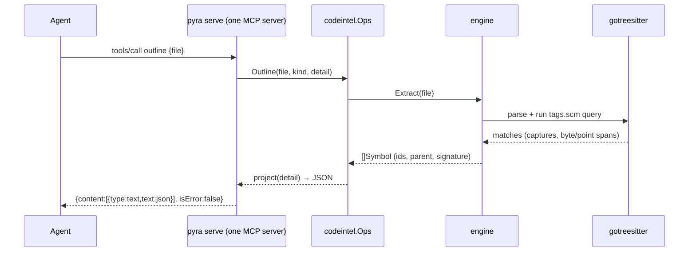

# Design Document — Code Intelligence

## Context

Pyra is a single Go binary that turns a team's decisions into gate-enforced **Canon** and serves it to agents over MCP, but it cannot see real code — agents must leave Pyra and grep. **grove** is a Rust binary that provides byte-precise structural code search/navigation over tree-sitter, behind stable `symbol-id`s, as both a CLI and an MCP server. This design brings grove's capabilities *natively* into Pyra so one binary and one MCP server answer both "what did we decide?" and "what does the code do?", and can **ground** authoritative artifacts in real code.

The requirements phase fixed one decision: a **native Go re-implementation** — no Rust runtime, no separately-installed `grove`, no embedded/proxied grove binary (REQ-301, REQ-302, REQ-303). This document turns that mandate into an implementable design and resolves the central open question the requirements flagged: *how does a pure-Go binary parse 27 languages and obtain grammars without breaking Pyra's cross-compiled, offline, deterministic guarantees?*

## User Need

- An agent working through Pyra needs `outline`, `symbols`, `source`, `check`, `callers`, `map`, and `definition` over its codebase, returning stable `symbol-id`s it can pass between turns (REQ-101 … REQ-110), from one MCP server that also carries the authority tools (REQ-201 … REQ-206) and from CLI subcommands (REQ-401 … REQ-404).
- The toolchain owner needs this delivered by the single `pyra` binary, cross-compilable to all five Makefile targets, with grammars available offline (REQ-301 … REQ-305, REQ-601 … REQ-605), and **without** disturbing the deterministic, network-free authority/gate path (REQ-501 … REQ-506).
- An agent reasoning about a decision needs to resolve a Canon artifact to the real symbols it governs, and a `symbol-id` back to the artifacts that reference it — read-only (REQ-701 … REQ-704).

## Design

### Overview

We add a self-contained `internal/codeintel` package that re-implements grove's seven operations in Go, driven by **`gotreesitter`** (`github.com/odvcencio/gotreesitter`) — a pure-Go, cgo-free tree-sitter runtime with full Query-API support, embedded grammar blobs, and ABI-15 compatibility. grove's extraction *semantics* (the `symbol-id` scheme, the `.scm` tag/locals/imports queries, and the manifest `profile` that parameterizes extraction) are **ported and vendored** as Go code plus `//go:embed`-ed query assets. Two thin faces reuse the package: a set of cobra subcommands (`internal/cli/codeintel.go`) and an MCP tool group (`internal/mcp/codeintel.go`, `registerCodeIntelTools()`), mirroring exactly how `internal/mcp/canon.go` bridges the store today. A **grounding** layer bridges `store.Store` and `codeintel` to satisfy REQ-701 … REQ-704.

#### Key decision: `gotreesitter` (pure Go), not CGO bindings

| Option | Cross-compiles to 5 targets? | Single binary? | Offline grammars? | Verdict |
|---|---|---|---|---|
| `smacker`/official CGO bindings | ✗ needs per-target C toolchains — **breaks `make build-all`** | ✗ (cgo) | bundled C | **Rejected** |
| `malivvan` (wazero WASM) | ✓ | ✓ | ✗ only C/C++, no runtime grammar load | **Rejected** (pre-release, no arbitrary grammars) |
| Reuse grove `grammar.wasm` via custom wazero WasmStore | ✓ | ✓ | ✓ | **Rejected** — large bespoke runtime to re-build tree-sitter's wasm query engine in Go |
| **`gotreesitter` (pure Go)** | **✓ zero cgo** | **✓** | **✓ embedded blobs** | **Chosen** |

Rationale: Pyra's Makefile cross-compiles `linux/darwin/windows × amd64/arm64` with plain `go build` and no C toolchains; the only existing cgo touchpoint (Apple FM) is fenced behind the `applefm` tag with pure-Go fallbacks. A cgo tree-sitter would force that same fencing on the *core* code path and still break `go install` for downstream users. `gotreesitter` is pure Go (compiles anywhere Go targets), exposes the standard Query API with named captures and predicates (156 highlight + 69 tag queries validated upstream), loads the same parse-table format as the C runtime (ABI 15), and ships grammars as embedded blobs selectable by build tag. It is MIT-licensed and benchmarks at or above the C runtime for our workload. This single choice satisfies REQ-302/REQ-303 (native Go, no Rust/no proxy) and — because grammars embed with **no network at all** — trivially satisfies the offline/determinism requirements (REQ-504, REQ-505, REQ-604) and keeps the authority-path-purity risk near zero.

#### What we port from grove vs. what we take from gotreesitter

- **From gotreesitter:** the tree-sitter runtime (parser, query engine, cursors, node byte/point APIs) and the language grammars.
- **Ported from grove (re-implemented in Go, semantics preserved):** the `symbol-id` format and its two parsers; the `Symbol`/`Defect`/`CallSite`/`MapEntry`/`SourceResult` shapes; profile-driven extraction (`function_kinds`, `containers`, `identifier_kinds`, `import_resolution`); overlapping-tag dedup; caller structural-vs-textual provenance; and scope-aware + import-edge `definition --at` resolution.
- **Vendored from grove (as `//go:embed` assets):** per-language `tags.scm`, `locals.scm`, `imports.scm`, and the `profile` block of each `manifest.json`, under `internal/codeintel/registry/<lang>/`. These are data, not Rust code, and carry grove's extraction intent verbatim.

### Architecture



The dashed "no dependency" edge is load-bearing: `internal/codeintel` and its grounding bridge live **outside** `internal/canon/…`, so the archcheck test (`internal/canon/archcheck_test.go`, which forbids `net/http`, the summarizer, and the FM bridge in the authority path) is unaffected, and `pyra gate`'s dependency graph — hence its behavior and output — is unchanged (REQ-501, REQ-502, REQ-503).

#### Request flow (one MCP call)



### Components and Interfaces

**`internal/codeintel` (new, pure Go, no network).** Package doc comment on `codeintel.go`.

```go
// Package codeintel provides structural code search and navigation
// (a native Go port of grove's operations) over a pure-Go tree-sitter runtime.
package codeintel

type Symbol struct {
    ID          string  `json:"id"`
    Name        string  `json:"name"`
    Kind        string  `json:"kind"`
    IsDefinition bool   `json:"is_definition"`
    File        string  `json:"file"`
    Line        int     `json:"line"` // 1-based
    Col         int     `json:"col"`  // 1-based
    StartByte   int     `json:"start_byte"`
    EndByte     int     `json:"end_byte"`
    Signature   string  `json:"signature"`
    Parent      *string `json:"parent,omitempty"`
}

// Engine holds a per-language loaded grammar + compiled queries (lazy, cached).
type Engine struct { /* grammar cache keyed by lang; guarded by sync.RWMutex */ }

func NewEngine(reg *Registry) *Engine
func (e *Engine) Extract(path string) (syms []Symbol, tree *gts.Tree, err error) // one parse
func (e *Engine) Check(path string) ([]Defect, error)
func (e *Engine) ResolveLocalAt(path string, row, col int) (*Symbol, bool)
func (e *Engine) Slice(src []byte, s Symbol) string

// Ops is the shared operation surface both faces call.
type Ops struct{ eng *Engine }

func (o *Ops) Outline(file, kind string, detail int) ([]any, error)
func (o *Ops) Symbols(dir, kind, name string, refs, nameContains bool) ([]Symbol, error)
func (o *Ops) Source(idOrFile, name string) (SourceResult, error)
func (o *Ops) Check(file string) ([]Defect, error)     // callers get exit-code from len>0
func (o *Ops) Callers(dir, name string) ([]CallSite, error)
func (o *Ops) Map(dir, kind, name string, nameContains bool) ([]FileMap, error)
func (o *Ops) Definition(name, at, dir string) (DefinitionResult, error)
```

- **`symbolid.go`** — `Format(lang, rel, name string, line int) string` → `"<lang>:<rel>#<name>@<line>"` (1-based line); `ParseID(s) (path, name string, line int, ok bool)` splitting `lang:` at the **first** colon then `#` then `@` (line optional); and a **separate** `ParsePos(s) (path string, row, col int)` using last-3 `:` split to protect colon-bearing paths, converting 1-based input to 0-based. These are deliberately two parsers (grove gotcha).
- **`registry.go`** — resolves per-language `Profile{FunctionKinds, Containers []NameField, IdentifierKinds, ImportResolution}` + the three `.scm` query texts from `//go:embed registry/*`. Extension→language map mirrors grove's manifests. No filesystem/network lookup in the default build (embedded); an **optional** external override dir (`PYRA_CODEINTEL_REGISTRY` / `.pyra/grammars`) is a documented seam for REQ-604 but not required for core operation.
- **`engine.go`** — `Extract` runs the `tags.scm` query via a `gotreesitter` `QueryCursor`, mapping `@definition.<kind>`/`@reference.<kind>`/`@name` captures exactly as grove does; widens function/method spans to the body via `function_kinds`; fills `parent` via `containers`; dedups overlapping matches by `(start_byte, end_byte, is_definition)`. `.scm` compile errors degrade the optional feature silently; queries containing `(a/b)` supertype syntax are refused (grove's segfault guard — port as a defensive check even though the pure-Go engine is memory-safe, to preserve identical capability semantics).

**`internal/cli/codeintel.go` (new).** Seven cobra commands (plus `ground`) following the `gate.go`/`relationships.go` pattern: package-level `*cobra.Command`s, `init(){ rootCmd.AddCommand(...) }`, `--json` bool flag, human output via `fatih/color` by default. `pyra check` exits non-zero when defects exist (REQ-403) via `os.Exit(1)` like `gate.go`. Directory walks are gitignore-aware and exclude `*.d.ts`/`.d.cts`/`.d.mts` (REQ-103, REQ-802); traversal is rooted at the given path and never escapes it (REQ-803).

**`internal/mcp/codeintel.go` (new).** Adds `func (s *Server) registerCodeIntelTools()` called from `NewServer` right after `s.registerCanonTools()` (`server.go:79`). Registers the seven tools with grove's exact names, descriptions, and flat `{type:object, properties, required}` input schemas (no top-level `anyOf`/`oneOf` — some clients drop such tools), plus two grounding tools. Handlers use the established signature `func (s *Server) handleX(_ context.Context, r mcp.CallToolRequest) (*mcp.CallToolResult, error)`, read args via `getArgString`/`getArgFloat`, return `s.jsonResult(...)` (indented JSON, truncated at `maxResultChars`), and encode domain failures as `{"error": ...}` with a nil Go error so the server never crashes (REQ-206). Because these tools don't need Canon, they function even when `s.store == nil` (REQ-204); the authority tools already function when the code dir is absent (REQ-205).

**Grounding (REQ-701 … REQ-704).** Lives in `internal/mcp/codeintel.go` (it needs both `s.store` and `Ops`), exposed as two read-only tools:
- `code_for_artifact {id}` — load the Canon artifact via `s.store.ByID(id)`, scan its body for `symbol-id` tokens (regex `([\w-]+):([^#\s]+)#([^@\s]+)@(\d+)`) and for resolvable bare names, resolve each via `Ops.Source`/`Ops.Definition`. Unresolvable references (renamed/moved/deleted) are returned in an `unresolved: []` list rather than mismatched (REQ-704).
- `artifacts_for_symbol {id|file}` — given a `symbol-id` or file path, `s.store.Discover(query)` over the unified index to surface Canon artifacts that mention it, filtered to `TierCanon`. Never writes Canon (REQ-703).

**`internal/config` change.** Add `CodeRoots []string yaml:"code_roots"` (default `["."]`) so `pyra serve`/CLI know the default search scope when no explicit path is given. Backward-compatible (missing key → default), consistent with how `canon_roots`/`spec_roots` are loaded.

#### CLI/MCP parity note (intentional deviation from grove)

grove's `definition` returns a bare `Symbol` array on the CLI but `{resolved, definitions}` over MCP. REQ-203 requires CLI and MCP to be equivalent, so we **standardize both** on `DefinitionResult{Resolved string, Definitions []Symbol}`. This is the one deliberate divergence from grove's internal behavior, made in service of a requirement.

### Data Models

Ported 1:1 from grove (field names/JSON preserved for parity, REQ-203 and the "equivalent to grove" success metric):

- `Symbol` — above.
- `Defect{Kind "missing"|"error", Line, Col, StartByte, EndByte int, Text string}` (Text = first 60 chars).
- `SourceResult{ID, Source string, OtherCandidates []string omitempty}`.
- `CallSite{File string, Line, Col int, InFunction *string omitempty, Text, Source string}` where `Source ∈ {"structural","textual"}`.
- `FileMap{File string, Entries []MapEntry}`, `MapEntry{ID, Kind, Name string, Parent *string omitempty, Row int /* carries 1-based line */, Signature string, References []string omitempty}`. (The `Row`-holds-`line` quirk is preserved for byte-parity with grove JSON.)
- `DefinitionResult{Resolved string, Definitions []Symbol}` (unified, see above).
- `Profile{FunctionKinds []string, Containers []NameField, IdentifierKinds []string, ImportResolution string}`; `NameField{Kind, Field string}`.
- Outline projection tiers (detail `0/1/2`) reproduced exactly: `0` = `{kind,name,parent?,line}`; `1` = adds `{id,col,signature}`; `2` = full `Symbol`.

**Grammar/registry data model.** `internal/codeintel/registry/<lang>/` holds `tags.scm`, `locals.scm?`, `imports.scm?`, `profile.json` (the profile block only), embedded via `//go:embed registry`. The v1 supported set is **Go, Python, JavaScript, TypeScript, TSX, Java, and Rust** — each has both a vendored query set and a gotreesitter grammar loader (`grammarLoaders` in `registry.go`), pinned and documented (REQ-603). Only these grammars are embedded, via gotreesitter's `grammar_subset` build tags set in the Makefile (`CODEINTEL_TAGS`), keeping the release binary ~39 MB rather than the ~60 MB a plain all-206-grammar embed produces. Adding a language means vendoring its assets, adding a loader, and adding its `grammar_subset_<lang>` tag.

### Error Handling

- **Unsupported/unprovisioned language** — `Extract` returns a typed `ErrUnsupportedLanguage(ext)`; directory ops skip the file and continue (REQ-602, REQ-206); single-file ops surface a clear message. MCP encodes it as `{"error":...}` with nil Go error (server stays up).
- **Missing file / bad path** — wrapped `os` error; MCP → `{"error":...}`; CLI → non-zero exit with message.
- **Syntax errors** — not errors: `check` returns a `Defect` list; CLI `pyra check` exits non-zero iff the list is non-empty (REQ-403, REQ-109).
- **Malformed `symbol-id` / position** — `ParseID`/`ParsePos` return `ok=false`; op returns a descriptive error naming the expected form (`<lang>:<relpath>#<name>@<line>` or `file:line:col`).
- **Optional-query compile failure** — the locals/imports feature degrades to "off" for that language; `definition --at` falls back to name lookup, so it is never worse than name mode (REQ-107/REQ-108).
- **Unresolved grounding reference** — returned in `unresolved` rather than guessed (REQ-704).
- **Path escape** — walks are constrained to the provided root; a symlink or `..` that would escape is rejected with a clear error (REQ-803).
- **Determinism** — all list outputs are sorted with total orders (files by name, entries by line then byte-span, references sorted+deduped) so identical repo state yields identical bytes (REQ-506); no clock/RNG on read paths.

### Testing Strategy

- **Unit tests** (`internal/codeintel/*_test.go`, table-driven, colocated per Pyra convention): `symbolid` round-trip and the two-parser split gotchas; per-op extraction on small fixtures per language; outline detail tiers; overlapping-tag dedup order; caller structural/textual partition (and the "each file parsed once" guard); `definition --at` scope shadowing and import-edge resolution for `dotted_package` (Python) and `relative_path` (JS/TS).
- **grove-parity conformance** (`internal/codeintel/testdata/parity/`): a corpus of source files with golden JSON captured from `grove <op> --json`. A test asserts Pyra's output matches, normalizing only the documented, intentional deviation (`definition` shape). This is the primary defense for the "equivalent to grove" success metric and the grammar-version parity risk.
- **Cross-compile guard** (CI / a `make` check): `CGO_ENABLED=0 make build-all` must succeed for all five targets — the executable proof of REQ-301/REQ-302 and that no cgo crept in.
- **Authority-path regression:** the existing `internal/canon/archcheck_test.go` and `internal/canon/gate/determinism_test.go` must stay green, proving `pyra gate` is untouched (REQ-501/REQ-502/REQ-503). Add an assertion that `go list -deps .../internal/canon/...` does not include `internal/codeintel` or `gotreesitter`.
- **MCP tests:** `tools/list` includes the new tools with valid schemas (REQ-202); a code tool returns the same payload as the corresponding CLI op (REQ-203); tools function with `store == nil` (REQ-204); a failing tool returns `isError`/`{"error"}` without killing the server (REQ-206).
- **CLI tests:** flag parsing and `--json` shape per op; `check` exit code; gitignore exclusion and root-confinement (REQ-802/REQ-803), following the existing `cli_test.go`/`project_test.go` patterns.
- **Grounding tests:** artifact→code resolves embedded `symbol-id`s and lists `unresolved` for a deleted symbol; code→artifacts finds a Canon artifact that cites a `symbol-id`; both are read-only (REQ-701/REQ-702/REQ-703/REQ-704).

## Constraints

- **No cgo on the core path.** The whole design hinges on `gotreesitter` staying pure Go so `make build-all` keeps working with plain `go build`. If a needed grammar existed only in a cgo binding, it would be added behind a build tag with a pure-Go fallback (the `applefm` pattern) — never on the default path.
- **`internal/codeintel` must not be imported by `internal/canon/…`.** This preserves the archcheck boundary and gate determinism. Grounding, which touches the store, lives in the `mcp` layer, not in `canon`.
- **Parity is defined by the conformance corpus**, not by prose. The `symbol-id` format, JSON field names (including the `MapEntry.row`-holds-line quirk), and 1-based line/col conventions are frozen to match grove.
- **Offline by construction.** Grammars embed; the default build makes zero network calls, keeping REQ-504/REQ-505 satisfied without any provisioning code in v1. The external-registry override is a documented, optional seam only.

## Rationale

TODO

## Alternatives

TODO

## Accessibility

TODO

## Style Guidance

TODO

## Open Questions

TODO

## Related Requirements

- OKF-A9A05Q5BP012
