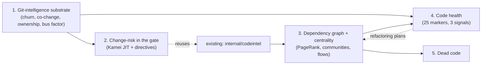

# Repowise-parity roadmap

This document sequences the [repowise](https://github.com/repowise-dev/repowise)
capabilities that are a genuine fit for Memphis's model — **deterministic,
offline, AI-free, git- and tree-sitter-derived, and reinforcing the authority
tier** — into an implementable order with explicit dependencies. It is a
planning artifact, not a spec; each numbered capability graduates into its own
`specs/<feature>/` when picked up.

## Framing (first principles)

Memphis is an **authority layer**: Canon is enforced truth, the gate blocks
drift, and code intelligence + grounding tie authority to real code. Repowise is
a **codebase-intelligence layer**: it measures risk and structure across the
graph and git history. The overlap that matters is the set of repowise signals
that are (a) deterministic and offline like the Canon gate, and (b) make the
*authority* model sharper — e.g. a gate that says "this diff touches governed
code **and** ranks Elevated risk with no tests," or a hotspot that carries *no*
governing Canon (`ungoverned_hotspot`).

We deliberately **exclude** repowise's LLM wiki/RAG (Memphis's Reference tier +
summarize already cover this), output distillation, the web dashboard, and the
VS Code extension: they are either already present or a scope departure from a
CLI + MCP binary.

### Non-negotiable constraints (inherited from Memphis's invariants)

1. **Authority-path purity.** Nothing gate-facing may import an LLM or the
   network. New signals live *outside* `internal/canon/...` (like
   `internal/codeintel` and `internal/changegate`), enforced by the boundary
   test. Runtime is a pure function of repo state.
2. **Implementation & licensing.** Repowise is **AGPL-3.0**. Default posture is an
   *independent* implementation of the approach (Kamei-style change metrics,
   churn×complexity hotspots, co-change from commit history) from primary sources.
   **Exception (change-risk, by explicit decision):** to be parity-testable against
   repowise immediately, its change-risk model + learned constants are ported
   verbatim, confined to a single attributed, swappable file. Those constants carry
   AGPL terms — relevant if Memphis is distributed under other terms — and are meant
   to be replaced by Memphis-owned constants later. Memphis currently ships **no
   LICENSE file**; resolving that is a prerequisite to any distribution.
3. **Honesty over headline.** Where repowise ships a defect-calibrated absolute
   score, Memphis leads with **repo-relative ranking** (percentile / tercile
   over the repo's own history), which needs no external calibration artifact and
   never overclaims a number we did not train. Attributable per-feature drivers
   are shown for transparency.

## The sequence

### 1. Git-intelligence substrate — `internal/gitint`

The behavioral layer static analysis can't see, and the base every later
capability draws on.

- **Churn** per file/symbol (commit count, lines touched over a window).
- **Co-change pairs**: files that change together in the same commit *without* an
  import edge (hidden coupling AST parsing misses) — cross-referenced against
  `internal/codeintel` import edges to subtract structural links.
- **Ownership %** and **bus factor** (files owned >80% by one author).
- **Hotspots**: files in the top quartile of *both* churn and complexity
  (complexity from the code-health markers once #4 lands; until then, a size/AST
  proxy).

Deterministic, `git log`-derived, offline. Consumed by #2 and #4. **Status: landed**
([`specs/git-intelligence/`](../specs/git-intelligence/)). One bounded
`git log --numstat` walk anchored to HEAD's commit time yields per-file metrics
(commit windows, churn, age, temporal hotspot score, ownership %, recent owner,
contributor count, bus factor, co-change), a repo-relative hotspot ranking, and
module rollups — surfaced via `memphis hotspots` / `memphis ownership` and the
`get_hotspots` / `get_ownership` MCP tools. Ownership is by commit-author
distribution; `git blame` line-ownership and the **churn×complexity** hotspot
intersection are deferred to code-health (#4), which needs the complexity markers.

### 2. Change-risk in the gate — `internal/changerisk` **(first spec)**

Score a change (staged diff or `base..HEAD`) for defect risk from the *shape of
the diff*, surfaced alongside the change-aware gate's governance findings.

- **Kamei JIT metrics**: `la`/`ld` (lines ±), `nf` (files), `nd`/`ns`
  (directories / subsystems), `entropy` (Shannon over per-file churn), `exp`
  (author prior-commit count).
- **Repo-relative headline**: `Below typical` / `Typical` / `Elevated` + a
  percentile over the repo's own recent commits (the portable signal), with the
  raw composite shown as a secondary, clearly-labeled number.
- **PR directives** (advisory findings, escalatable by policy):
  `missing_tests` (changed source without its test in the diff),
  `missing_cochanges` (frequent co-change partners absent from the diff, via #1),
  `will_break` (dependents of changed symbols, via `internal/codeintel`), and
  `governance_risk` — **free from the change-aware gate**: the diff touches
  Accepted Canon.
- **Integration**: a `--risk` flag on `memphis gate` (and a standalone
  `memphis risk <range>`), emitting one risk summary + directive findings that
  merge into the same `gate.Result` / exit code / JSON / SARIF as governance
  findings.

Depends on a minimal slice of #1 (co-change + churn + author), which this spec
bootstraps and #1 later generalizes.

### 3. Dependency graph + centrality — `internal/codegraph`

Promote `internal/codeintel`'s on-demand structural reads into a persistent,
queryable graph: two-tier file+symbol nodes, PageRank / centrality, Leiden (or
label-propagation) communities, execution flows. Powers "which symbols are
hubs," better `will_break` ranking (centrality-weighted), and #5.

### 4. Code health — `internal/codehealth`

Repowise's crown jewel: **25 deterministic markers** (McCabe, deep nesting, brain
methods, LCOM4, god class, Rabin–Karp clones, untested hotspots, churn, code-age
volatility, ownership dispersion, change entropy, co-change scatter, prior-defect
history, test smells) → three separate signals (**defect risk /
maintainability / performance**), plus **graph-aware refactoring plans** (Extract
Class / Helper, Move Method, Break Cycle, Split File) with blast radius. Leads
with repo-relative ranking; ships no un-trained absolute claim. Authority tie-in:
`ungoverned_hotspot` (a low-health hotspot with no governing Canon) and
`stale_governance`. Depends on #1 (git signals) and benefits from #3 (graph).

### 5. Dead code — `internal/deadcode`

Unreachable definitions by confidence tier with cleanup-impact estimates, built
on the #3 reachability graph, honoring entry points and framework routes.

## What each capability adds to the authority model

| Capability | Authority tie-in |
|---|---|
| Git-intelligence | co-change reveals hidden coupling *between governed symbols*; hotspots that lack Canon |
| **Change-risk** | `governance_risk` directive; risk + governance in one gate/exit code |
| Graph + centrality | centrality-weighted `will_break`; ground Canon to graph hubs |
| Code health | `ungoverned_hotspot`, `stale_governance` as health findings |
| Dead code | dead symbols that Canon still cites (drift) |

## Deferred / out of scope for parity

LLM wiki + hybrid RAG (covered by Reference + summarize), `distill` output
compression, web dashboard, VS Code extension, agent provenance, hosted/PR-bot
surfaces. Revisit only if a concrete need emerges.
